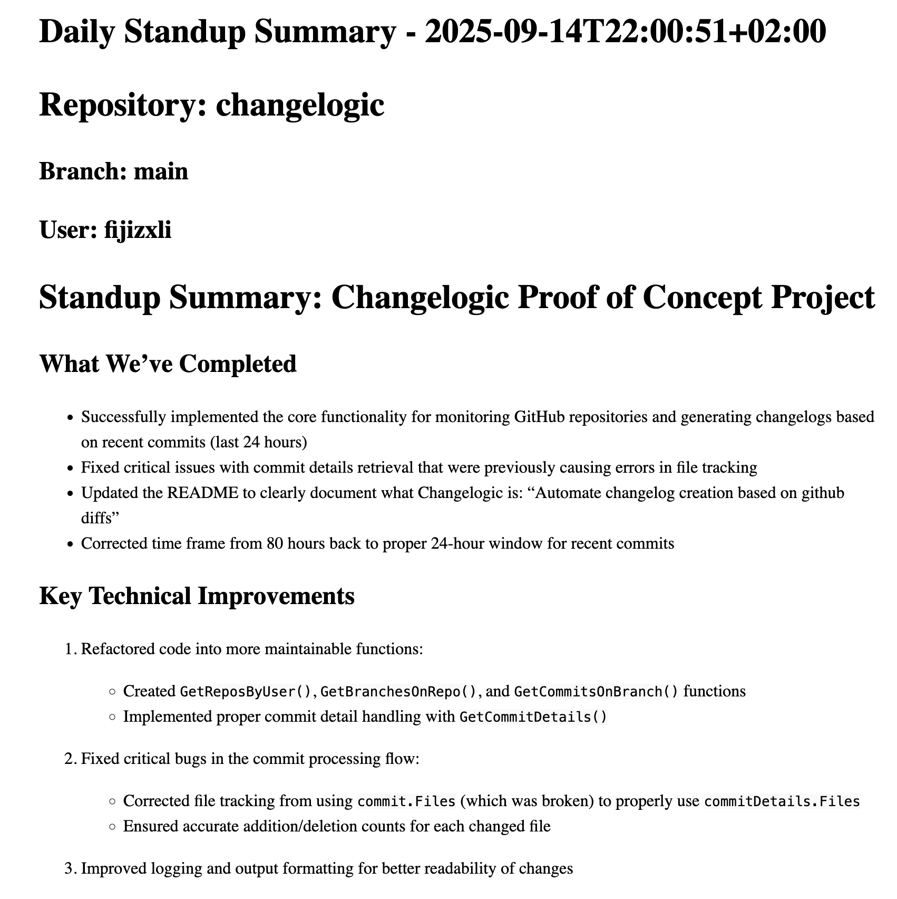

# Changelogic - Proof of Concept
Automate daily standup notes, changelogs, weekly reports with changelogic by generating markdown summaries with the help of LLMs, and turning them into static websites with hugo.

The project is still in development and is a proof of concept. I plan to have an MVP by the end of next week.

### Example: 
diffs -> ollama (qwen3:1.7b) -> markdown -> static html site with hugo

